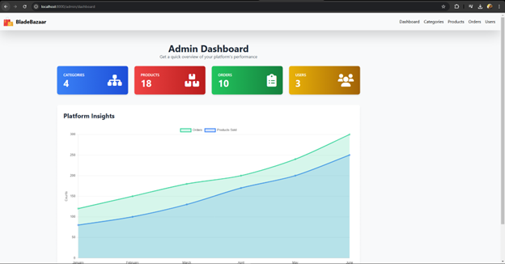
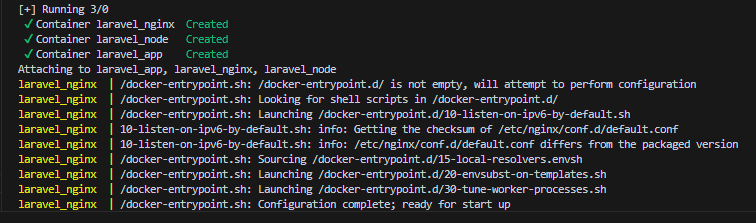
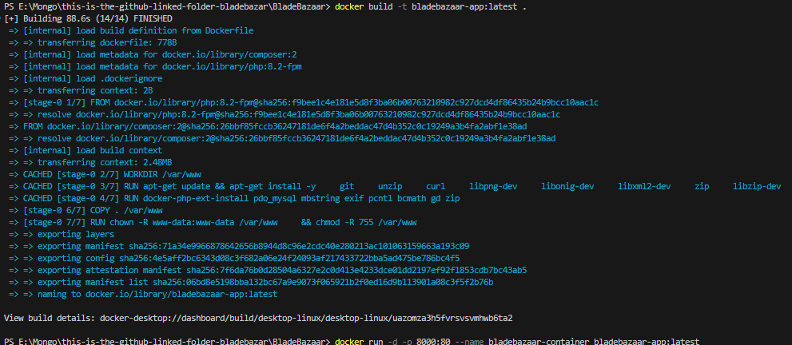
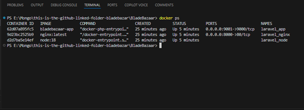

# BladeBazaar

BladeBazaar is a Laravel application for managing an online store, designed to be containerized using Docker for easy deployment and management.

## Table of Contents
- [Team Members](#team-members)
- [Screenshots](#screenshots)
- [Dockerization](#dockerization)
- [Running on Docker](#running-on-docker)
- [Stopping and Removing Containers](#stopping-and-removing-containers)
- [Troubleshooting](#troubleshooting)


## Team Members:
### Pranav Panchal
### Rajat Sachdeva
### Shrabani Sagareeka
### Mitali Sharma
### Abdun Nayeem Khan

## Screenshots


---

## Dockerization

This project has been containerized using Docker to ensure easy deployment and consistency across environments.

### Docker Compose Configuration

The application uses Docker Compose to simplify container orchestration. The configuration is defined in the `docker-compose.yml` file, which includes:

- **App Service (`laravel_app`)**: Runs the Laravel application using PHP-FPM.
- **Webserver Service (`laravel_nginx`)**: Uses Nginx to serve the Laravel application.
- **Node Service (`laravel_node`)**: Handles Node.js tasks like running `npm run dev` for frontend assets.

Here's the `docker-compose.yml`:

```yaml
version: '3.8'

services:
  app:
    build:
      context: .
    container_name: laravel_app
    ports:
      - "9001:9000"
    volumes:
      - .:/var/www
    networks:
      - laravel

  webserver:
    image: nginx:latest
    container_name: laravel_nginx
    ports:
      - "8000:80"
    volumes:
      - .:/var/www
      - ./nginx.conf:/etc/nginx/conf.d/default.conf
    networks:
      - laravel

  node:
    image: node:18
    container_name: laravel_node
    working_dir: /var/www
    volumes:
      - .:/var/www
    command: sh -c "npm install && npm run dev"
    networks:
      - laravel

networks:
  laravel:
    driver: bridge
```

---

## Running on Docker




### Build and Start the Containers

1. **Build and Start Services**:
   Run the following command to build the images and start all the containers defined in `docker-compose.yml`:

   ```bash
   docker-compose up --build
   ```

   

2. **Access the Application**:
   Once the containers are running, you can access the application in your browser at:

   ```
   http://localhost:8000
   ```

3. **Running the Frontend Development Server**:
   The Node.js service will automatically run `npm run dev` to compile assets. You can check the logs to confirm that it's working as expected. PS - if style is not loading, run "npm run dev" on your local machine


---

## Stopping and Removing Containers

To stop the running containers:

```bash
docker-compose down
```

---

## Troubleshooting

### Port Conflicts

If you encounter a port conflict (for example, if port `8000` is already in use), you can change the port mapping in the `docker-compose.yml` file:

```yaml
webserver:
  ports:
    - "8080:80"
```

Then restart the containers with `docker-compose up`.

### Viewing Logs

To check the logs for any service, you can run:

```bash
docker-compose logs <service_name>
```

For example, to view the logs for the Node.js service:

```bash
docker-compose logs node
```

### Accessing the Container's Shell

If you need to access the shell of a running container, use:

```bash
docker-compose exec <service_name> sh
```

For example, to access the app container:

```bash
docker-compose exec app sh
```

---

## Docker Images

Once the setup is complete, you can build a Docker image of the app using:

```bash
docker build -t bladebazaar-app:latest .
```



To run the container using the image:

```bash
docker run -d -p 8000:80 --name bladebazaar-container bladebazaar-app:latest
```

### Checking Running Containers

To view the currently running containers, use:

```bash
docker ps
```



This will show you a list of all running containers along with their status and ports.

---


